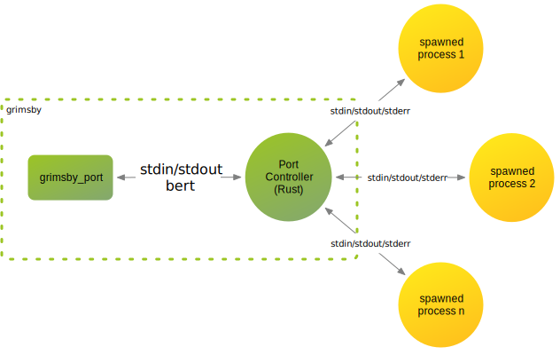

# Grimsby


An Erlang Port provides the basic mechanism for communication from
Erlang with the external world.

From the [Ports and Port Drivers: Erlang Reference
Manual][erlang-org-ref-ports]:

>The Erlang process creating a port is said to be the port owner, or
>the connected process of the port. All communication to and from the
>port must go through the port owner. If the port owner terminates, so
>does the port (and the external program, if it is written correctly).
>
>The external program resides in another OS process. By default, it
>reads from standard input (file descriptor 0) and writes to standard
>output (file descriptor 1). The external program is to terminate when
>the port is closed.

An Erlang Port will work exactly as they are designed to, closing the
port, terminates the program. A lot of times this is just *exactly*
what you need. Sometimes, however, you need to close standard input
(file descriptor 0) and still allow the program to continue running
(which is the use case here with `git`).

Grimsby is an Erlang Port written in Rust that can close its standard
input while retaining standard output (and error).

For example, the following using just `erlang:open_port/2` works
because standard input remains open:

```erlang
1> Port = erlang:open_port({spawn_executable, "/bin/cat"},
                           [binary, eof, use_stdio, exit_status, stream]).

2> erlang:port_command(Port, "hello world!").
true

3> flush().
Shell got {Port, {data, <<"hello world!">>}}
ok

4> erlang:port_close(Port).
true

5> flush().
ok
```

Whereas `sum` will not, because requires its standard input to be
closed before responding with the checksum:

```erlang
Port = erlang:open_port({spawn_executable, "/usr/bin/sum"},
                        [binary, eof, use_stdio, exit_status, stream]).

2> erlang:port_command(Port, "hello world!").
true

3> flush().
ok

4> erlang:port_close(Port).
truesum: 
stdout: Broken pipe

5> flush().
ok
```

The `erlang:port_close/1` closes standard input, but also closes
standard output (and error). The `data` message is never received with
the checksum as a result.

## Grimsby Command

With `grimsby_command`, an executable can be spawned, closing stdin if
and when necessary, while capturing output on both stdout and stderr:

```erlang
1> {ok, Spawn} = grimsby_command_sup:start_child(#{executable => "/usr/bin/sum"}).

%% send iodata to the spawned process...
2> ok = grimsby_command:send(Spawn, ["hello", <<" world!">>]).

%% close stdin...
3> ok = grimsby_command:close(Spawn).

%% important to wait for the spawned process to exit...
4> {ok, 0} = grimsby_command:wait_for_exit(Spawn).

%% output is captured from stdout and stderr as iodata:
5> grimsby_command:info(Spawn).
#{exit => 0,
  eof => [stderr, stdin, stdout],
  stderr => [],
  stdout => [[],<<"3785 1\n">>]}

6> grimsby_command:stop(Spawn).
```

The following parameters can be supplied to the spawned executable
with `grimsby_command`:

```erlang
%% mandatory full path of the executable to spawn
#{executable := string(),

  %% optional list of arguments (default [])
  args => [string()],

  %% optional map of environment variables
  envs => #{string() => string()},

  %% optional arg0 name
  arg0 => string(),

  %% optional working diretory of the process
  cd => file:filename()
```

## Grimsby Port



The module `grimsby_port` orchestrates the port protocol between
Erlang and the Rust process using [BERT][bert] framed in BURP (32 bit big
endian length). It is used by `grimsby_command`, and can be used by an
application that needs asynchronous notification on receiving data,
or the exit of the spawned process.

Note that, notifications are sent using `gen_statem:send_request/4`
and *must* be replied to! An 'ok' will continue processing, while
`{error, term()}` will stop the process.

The parameters supplied to spawn a process are the same as for
`grimsby_command`, with an additional (optional) parameter of
`send_to`:

```erlang
%% mandatory full path of the executable to spawn
#{executable := string(),

  %% optional list of arguments (default [])
  args => [string()],

  %% optional map of environment variables
  envs => #{string() => string()},

  %% optional arg0 name
  arg0 => string(),

  %% optional working diretory of the process
  cd => file:filename()

  %% optional pid/name of process to send messages
  %% default to pid of caller:
  send_to => gen_statem:server_ref()}
```

An example:

```erlang
1> {ok, Spawn} = grimsby_port:run(#{executable => "/bin/cat"}).
{ok,#Ref<0.1965200363.1370226689.233566>}

2> ok = grimsby_port:send(Spawn, ["hello", <<" world!">>]).
3> ok = grimsby_port:close(Spawn, stdin).
4> flush().

Shell got {'$gen_call',
              {<0.89.0>,[alias|#Ref<0.1965200363.1370292225.236183>]},
              {grimsby_port,{eof,#Ref<0.1965200363.1370226689.233566>,stdin}}}
Shell got {'$gen_call',
              {<0.89.0>,[alias|#Ref<0.1965200363.1370292225.236184>]},
              {grimsby_port,
                  {stdout,#Ref<0.1965200363.1370226689.233566>,
                      <<"hello world!">>}}}
Shell got {'$gen_call',
              {<0.89.0>,[alias|#Ref<0.1965200363.1370292225.236185>]},
              {grimsby_port,
                  {eof,#Ref<0.1965200363.1370226689.233566>,stdout}}}
Shell got {'$gen_call',
              {<0.89.0>,[alias|#Ref<0.1965200363.1370292225.236186>]},
              {grimsby_port,
                  {eof,#Ref<0.1965200363.1370226689.233566>,stderr}}}
ok
```

### Notifications

Assuming the following type definitions:

```erlang
-type stream() :: stdin | stdout | stderr.
```

```erlang
{grimsby_port, {error, Spawn :: reference(), Stream :: stream()}}
```

This is sent when an error has occured on a stream.

```erlang
{grimsby_port, {Stream :: stream(), Spawn :: reference(), Data :: binary()}}
```

This is sent when data is received on `stdout` or `stderr` from a
stream. Line buffering is present on the Rust streams (which can't
currently be disabled).

```erlang
{grimsby_port, {eof, Spawn :: reference(), Stream :: stream()}}
```

This is sent when end of file has been reached on a stream.

```erlang
{grimsby_port, {exit, reference(), integer() | signal}}
```

This is sent when the processes exits (with a status code) or is
killed by a signal.

### Protocol

The protocol between the Erlang port and Rust is BERT framed in BURP
with a 4 byte unsigned big endian packet length.

The following messages are exchanged over the port:

#### spawn

```erlang
{spawn,
 ChildId :: reference(),
 InteractionId :: reference(),
 #{executable := string(),

   %% optional list of arguments (default [])
   args => [string()],

   %% optional map of environment variables
   envs => #{string() => string()},

   %% optional arg0 name
   arg0 => string(),

   %% optional working diretory of the process
   cd => file:filename()}
}
```

On receipt of this message the Rust port controller will spawn a new
process using `executable` as the full path to the executable, with
threads monitoring `stdin`, `stdout` and `stderr`, associating
`ChildId` with the new process.

In response:

```erlang
{InteractionId :: reference(), ok}
```

If the process has spawned without error, where `InteractionId` is the
correlating reference for the request.

```erlang
{InteractionId :: reference(), {error, term()}}
```

If the process failed to spawn for some reason, where `InteractionId`
is the correlating reference for the request.

#### eof

```erlang
{eof, ChildId :: reference(), Stream :: stream()}
```

This message is received by the Erlang side indicating end of file for
`stdout` or `stderr`. Where `ChildId` is the reference used to
identify the spawned process in the `spawn` message.

#### output

```erlang
{stdout | stderr, ChildId :: reference(), Output :: binary()}
```

This message is received by the Erlang side indicating the output from
the spawned process either from `stdout` or `stderr`. Where `ChildId`
is the reference used to identify the spawned process in the `spawn`
message.

#### exit

```erlang
{exit, ChildId :: reference(), integer() | signal}
```

This message is received by the Erlang side indicating that the
spawned process either exited normally with a status code, or has been
killed by a signal. Where `ChildId` is the reference used to identify
the spawned process in the `spawn` message.

#### error

```erlang
{error, ChildId :: reference(), Stream :: stream()}
```

This message is received by the Erlang side indicating an error on a
stream of the spawned process. Where `ChildId` is the reference used
to identify the spawned process in the `spawn` message.

#### send

```erlang
{send, ChildId :: reference(), InteractionId :: reference(), Data :: binary()}
```

On receipt of this message the Rust port controller will send `Data`
to the `stdin` of the spawned process identified by `ChildId` from the
`spawn` message.

In response:

```erlang
{InteractionId :: reference(), ok}
```

If the data was queued to be sent to the spawned process. An error may
be sent asynchronously if the data cannot be written later.

```erlang
{InteractionId :: reference(), {error, term()}}
```

If the data could not be queued to the process.

#### close

```erlang
{close, ChildId :: reference(), InteractionId :: reference(), Stream :: stream()}
```

On receipt of this message the Rust port controller will close the
stream of the spawned process identified by `ChildId` from the `spawn`
message.

In response:

```erlang
{InteractionId :: reference(), ok}
```

If the request was queued to be sent to the spawned process.

```erlang
{InteractionId :: reference(), {error, term()}}
```

If the request could not be queued to the process.

#### wait for exit

```erlang
{wait_for_exit, ChildId :: reference(), InteractionId :: reference()}
```

On receipt of this message the Rust port controller will wait for the
exit of the spawned process identified by `ChildId` from the `spawn`
message.

In response:

```erlang
{InteractionId :: reference(), ok}
```

If the request was queued to be sent to the spawned process.

```erlang
{InteractionId :: reference(), {error, term()}}
```

If the request could not be queued to the process.

#### kill

```erlang
{kill, ChildId :: reference(), InteractionId :: reference()}
```

On receipt of this message the Rust port controller will kill the
spawned process identified by `ChildId` from the `spawn` message.

In response:

```erlang
{InteractionId :: reference(), ok}
```

If the request was queued to be sent to the spawned process.

```erlang
{InteractionId :: reference(), {error, term()}}
```

If the request could not be queued to the process.

## License

[Apache-2.0](LICENSE).

[bert]: https://www.erlang.org/doc/apps/erts/erl_ext_dist.html
[erlang-org-ref-ports]: https://www.erlang.org/docs/17/reference_manual/ports.html
